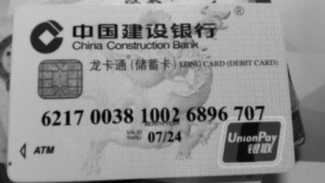
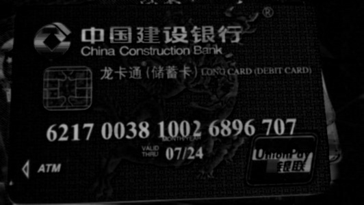
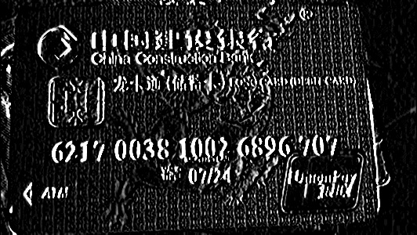
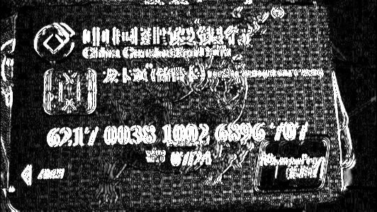
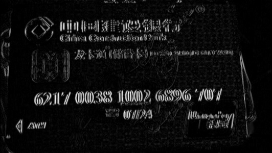
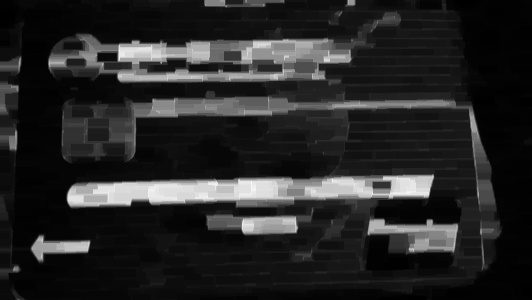
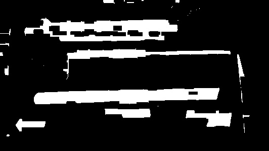
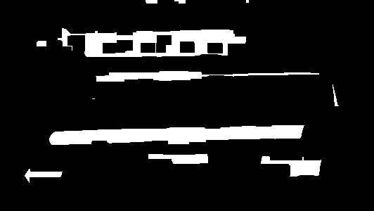
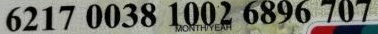
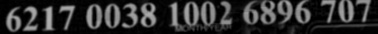

Case 2 银行卡卡号的检测和识别
==================================
.. toctree::
   :maxdepth: 2
   :caption: 内容:

.. highlight:: python
.. The first case. A start. Not well organized yet. 

Credit
---------------------

本例所用到的银行卡图片仅用于研究，请勿用于商业用途，图片来自网络搜索，所有权利归于原版权所有者。

卡号检测 
---------------------

这一步用到了很多图像处理技术，从图像中分割出目标区域是很常用的操作，可用于机读码等，是目标识别的基础。以建行储蓄卡为例，卡号有19位，分成5段。以下为从卡片上切割出卡号所在区域的过程。

* 加载图片

* 灰度处理

* 用高斯滤波作平滑处理
   
   * 为什么选用 3*3  的窗口大小?

* 形态学变换，BlackHat 处理，浅色卡片上黑色的数字作黑白转换，数字看上去很清晰
   
   * 为什么用BlackHat，不用TopHat?

* 用Sobel算子作边缘检测 
    
   * 有哪些算法用来作边缘检测?
   * 为什么这里不用Canny算子?

* 梯度处理 ::

	[[  0.  10.  10. ...,  32.  16.   0.]
	 [  0.   3.   6. ...,  29.  19.   0.]
	 [  0.   0.  10. ...,  19.  26.   0.]
	 ..., 
	 [  0.  39.  13. ...,   3.   3.   0.]
	 [  0.  35.  16. ...,   0.   0.   0.]
	 [  0.  32.  16. ...,   0.   0.   0.]]

* 梯度归一化处理，前一步获得的各点值是浮点数
 
    * 获取其最大值和最小值 ::

	minVal 0.0
	maxVal 1975.0

    * 将各点数值归一化到 [0-255] ::

	[[0 1 1 ..., 4 2 0]
	 [0 0 0 ..., 3 2 0]
	 [0 0 1 ..., 2 3 0]
	 ..., 
	 [0 5 1 ..., 0 0 0]
	 [0 4 2 ..., 0 0 0]
	 [0 4 2 ..., 0 0 0]]

* 对数字间隙作闭操作

* 利用Otsu阈值进行分割

* 对数字组之间的间隙作闭操作

* 通过多次腐蚀减少不明显的连通区域，注意腐蚀次数过多会腐蚀掉目标区域的边缘，这里选了2次

* 防止阈值误差

* 在原图中分割卡号区域

* 在BlackHat 处理后的图中分割卡号区域

卡号识别
---------------------

容后再续。

利用 AI 改进解决方案
---------------------

目前银行卡的种类很多，卡片的背景、数字的字体、排列以及位数都有所不同，按照上面的方法，来一个新卡片就需要调整参数，就不利于产品化，项目工程实施的时候就会对工程师有比较高的要求，工程师也对此不胜其烦。也有方案是通过穷举法来做的，将已有卡片数据作成可读取的数据配置文件进行外部加载，那么后面有新添加的卡片，也可通过更新数据配置文件达到目的。而 AI 的方法则能最大程度上获得通用性，这也是技术发展带来的好处。

容后再续。
